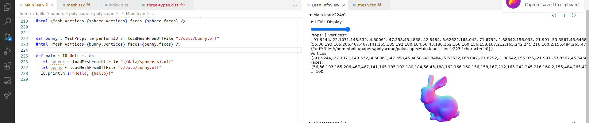

# Polyscope.lean

A port of [polyscope](https://polyscope.run/) to Lean4, to allow interactive
visualisation of geometric quantities such as meshes, and scalar and vector fields
on meshes.

Powered by [ProofWidgets4](https://github.com/EdAyers/ProofWidgets4)

